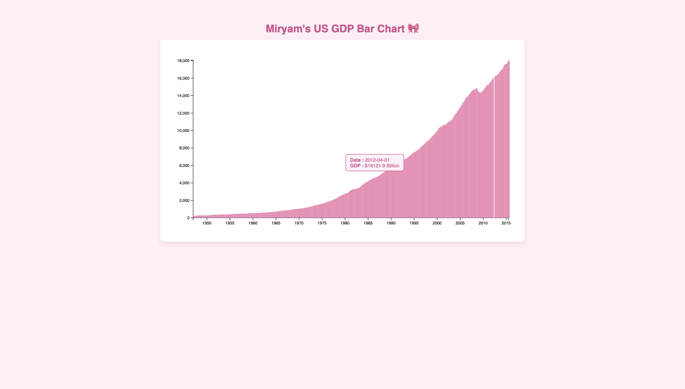

# US GDP Bar Chart – D3.js 🎀

  

Ce projet visualise l'évolution du PIB des États-Unis sous forme de bar chart interactif en utilisant la librairie **D3.js**.  
Il a été réalisé dans le cadre de l’UE *Data Vizualisation*.

## Fonctionnalités
- Échelle temporelle sur l’axe X (`scaleTime`)
- Échelle linéaire sur l’axe Y (`scaleLinear`)
- Barres SVG générées dynamiquement
- Tooltip interactif affichant la date et la valeur du GDP
- Conformité totale avec les *User Stories* freeCodeCamp

## Données
Les données du PIB proviennent du dataset officiel freeCodeCamp :  [GDP-data.json](https://raw.githubusercontent.com/freeCodeCamp/ProjectReferenceData/master/GDP-data.json)

## Technologies utilisées
- HTML
- CSS
- JavaScript
- D3.js

## Lancer le projet
Ouvrir simplement le fichier `index.html` dans un navigateur.